# AI4EO_Sentinel2_NDVI_Regression_Final

## Project Description

This project investigates whether artificial intelligence regression models can be used to predict vegetation greenness in a selected region using Sentinel-2 multispectral satellite imagery. Vegetation condition is important because it can show changes in plant health, photosynthetic activity, drought stress and land use. Satellite observation provides an effective way to monitor vegetation as it repeatedly records how land surfaces reflect light across different wavelengths. 

Vegetation greenness is represented in this project by Normalised Difference Vegetation Index (NDVI). It is based on the way in which healthy vegetation absorbs light. It strongly absorbs in the red part of the electromagnetic spectrum for photosynthesis, while reflecting strongly in the near-infrared due to internal leaf structure. 
NDVI is calculated as:

$$
NDVI = \frac{B8 - B4}{B8 + B4}
$$

Where B8 is the Sentinel-2 near-infrared band and B4 is the Sentinel-2 red band. High NDVI values generally indicate dense, healthy and photosynthetically active vegetation, while low NDVI values are associated with bare ground, built up areas, water, or sparse and stressed vegetation.

Although NDVI can be calculated directly from the red and near-infrared bands, in this project NDVI is used as the target variable for a supervised AI regression problem. The B4 and B8 bands are used to calculate the NDVI target values, but are not used as model inputs. Instead, the AI models are trained using other Sentinel-2 bands, including blue, green, red-edge and short-wave infrared bands.

The model is trained using Sentinel-2 imagery of Richmond Park and the surrounding region of southwest London. It represents a mixed landscape with both vegetated and urban elements. It contains grassland, woodland, bodies of water and the surrounding buildings. The trained model is then applied to Epping Forest in northeast London as an independent testing area. This allows us to assess whether the model trained in Richmond can be generalised to other regions. 

This project compares Polynomial, Random Forest and Neural Network models using Mean Squared Error, Root Mean Squared Error and R².  

The main aim of this project is to evaluate how effectively AI regression models can predict vegetation greenness from Sentinel-2 multispectral imagery. The secondary aim is to test whether the best-performing model can be applied successfully to an independent landscape. The use of predicted/observed scatter plots and feature importance analysis helps show how accurately the models can predict NDVI and which Sentinel-2 bands are most important for estimating vegetation greenness. 

See the diagram below which illustrates the remote sensing technique used in this project:


## Prerequisites

This project was completed using Google Colab.

- Mount Google Drive:

```python
from google.colab import drive
drive.mount('/content/drive')
```

- Install rasterio:

```python
!pip install rasterio
```

- Main Python libraries used:

```python
import numpy as np
import matplotlib.pyplot as plt
import rasterio

from sklearn.model_selection import train_test_split
from sklearn.metrics import mean_squared_error, r2_score
from sklearn.preprocessing import PolynomialFeatures
from sklearn.linear_model import LinearRegression
from sklearn.ensemble import RandomForestRegressor

import tensorflow as tf
```

The full setup code is provided in `project.ipynb`.

## Loading Sentinel-2 Data

The Sentinel-2 GeoTIFF files exported from Google Earth Engine were loaded into Google Colab using `rasterio`. Separate files were loaded for Richmond Park and Epping Forest.

The exported Sentinel-2 band order was:

```python
B2, B3, B4, B5, B6, B7, B8, B11, B12
```


## Calculating NDVI

NDVI was calculated for both Richmond Park and Epping Forest using the Sentinel-2 near-infrared band, B8, and red band, B4.

```python
ndvi_richmond = (B8 - B4) / (B8 + B4 + 1e-10)
ndvi_epping = (E_B8 - E_B4) / (E_B8 + E_B4 + 1e-10)
```

Because some `(B8 + B4)` where zero `1e-10` was added to avoid division by zero errors. This does not meaninglfully change NDVI value. 

### True NDVI Map - Richmond Park

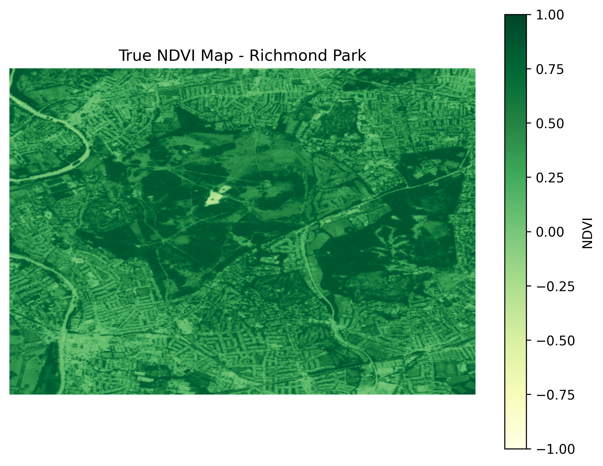

The Richmond Park NDVI map shows clear spatial variation in vegetation greenness across the region. Higher NDVI values are expected over woodland and grassland areas within the park, while surrounding built-up areas are associated with lower NDVI values. This variation makes Richmond Park a suitable training area as it exposes the model to a range of vegetated and urban elements. 

### True NDVI Map - Epping Forest

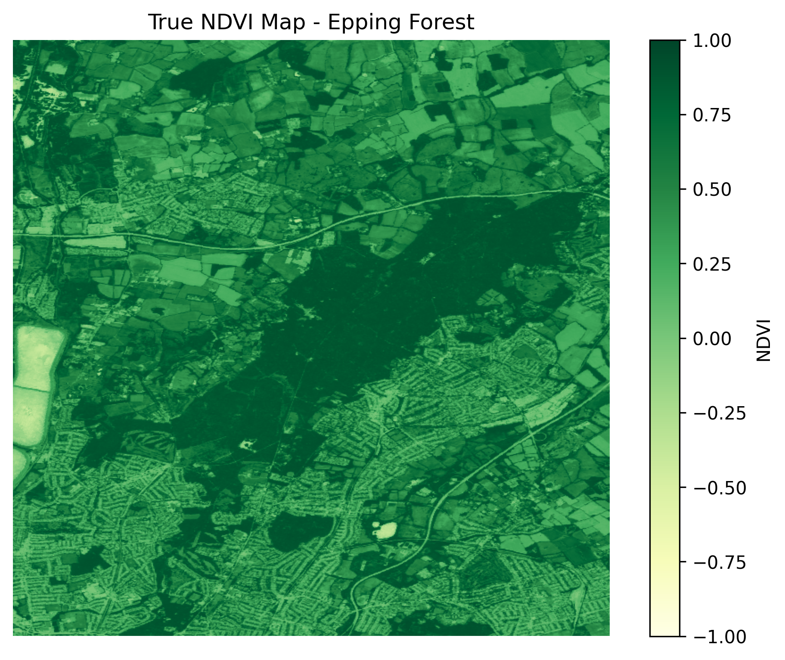

The Epping Forest NDVI map shows a generally high vegetation greenness across the central woodland area indicated by higher NDVI values. The surrounding urbanised area displays lower NDVI values. This confirms that Epping Forest is an appropriate testing site.  

## Preparing the Machine Learning Dataset

The machine learning dataset was created by stacking the selected Sentinel-2 input bands into one array and pairing each pixel with its calculated NDVI value.

Bands B4 and B8 were not included as model inputs because they were used to calculate NDVI directly. This avoids making the regression task meaningless. Instead, the model was trained using the following bands:

```python
X_richmond_stack = np.stack([
    B2, B3, B5, B6, B7, B11, B12
], axis=-1)
```

The dataset was then flattened so that each pixel became one training example. Invalid values were removed, and a random sample of 100,000 pixels was selected to keep model training efficient and reproducible.

The Richmond Park data were then split into training and internal testing datasets:

```python
X_train, X_test, y_train, y_test = train_test_split(
    X_sample,
    y_sample,
    test_size=0.2,
    random_state=42
)
```
This means that the models were trained on Richmond Park pixels and then evaluated on unseen Richmond Park pixels before being applied to Epping Forest. This provides an internal test of model performance before the separate independent test.

### Preparing the Epping Forest Independent Training Dataset

The Epping Forest dataset was prepared using the same Sentinel-2 input bands and NDVI target calculation as the Richmond Park dataset. The input bands were stacked and flattened so that each pixel represented one external testing example.

```python
X_epping_stack = np.stack([
    E_B2, E_B3, E_B5, E_B6, E_B7, E_B11, E_B12
], axis=-1)

X_epping = X_epping_stack.reshape(-1, X_epping_stack.shape[-1])
y_epping = ndvi_epping.reshape(-1)
```
Invalid Epping Forest pixels were removed using the same method as the Richmond Park dataset.

Unlike Richmond Park, the Epping Forest dataset was not included in the model training-testing split. It was kept separate as an independent testing dataset. This allows us to test whether models trained on Richmond Park can be generalised to a different vegetation-dominated landscape.

## Model Testing

Three regression models were trained using the Richmond Park training dataset and evaluated using the internal Richmond Park test set:

- Polynomial Regression
- Random Forest Regression
- Neural Network Regression

Model performance was assessed using Mean Squared Error (MSE), Root Mean Squared Error (RMSE) and R². Predicted/actual scatter plots were also used to assess how closely each model reproduced the calculated NDVI values.

### Polynomial Regression

Polynomial Regression was used as the first model. Degree 2 polynomial features were created to allow the model to learn simple non-linear relationships between the Sentinel-2 input bands and NDVI.

```python
poly = PolynomialFeatures(degree=2)

X_train_poly = poly.fit_transform(X_train)
X_test_poly = poly.transform(X_test)

poly_model = LinearRegression()
poly_model.fit(X_train_poly, y_train)

y_pred_poly = poly_model.predict(X_test_poly)

mse_poly = mean_squared_error(y_test, y_pred_poly)
rmse_poly = np.sqrt(mse_poly)
r2_poly = r2_score(y_test, y_pred_poly)
```

Polynomial Regression results:

```text
MSE: 0.0117
RMSE: 0.1082
R²: 0.7868
```

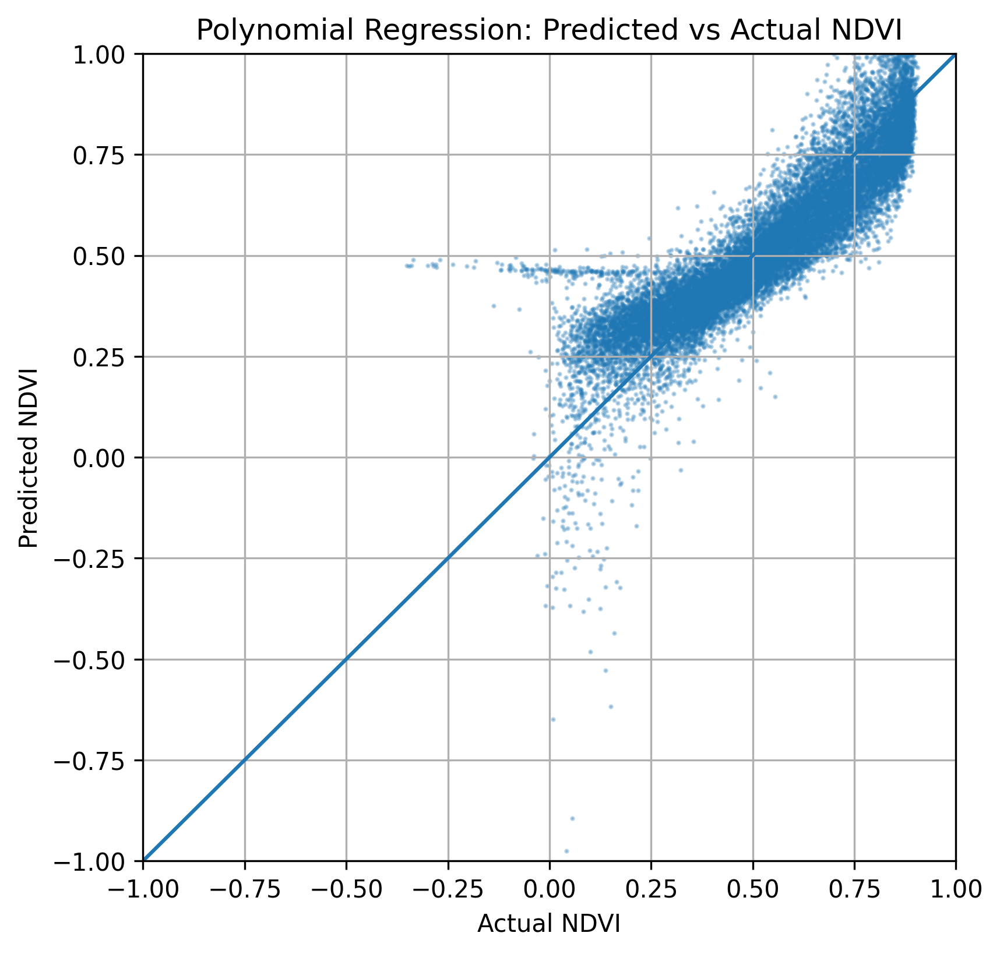

Polynomial Regression provided a reasonable baseline model, with an R² value of approximately 0.79. This indicated that the model captured much of the relationship between the Sentinel-2 input bands and NDVI but it was less accurate than the best performing model. The predicted/actual plot shows a generally positive relationship but some spread is visible above the 1:1 line. The location of this spreading suggests that the Polynomial Regression struggled to reproduce some lower and intermediate NDVI values accurately.

### Random Forest Regression

Random Forest Regression was used as a non-linear machine learning model. Unlike Polynomial Regression, Random Forest can model more complex relationships between Sentinel-2 spectral bands and NDVI without requiring a fixed mathematical relationship to be specified in advance.

```python
rf_model = RandomForestRegressor(
    n_estimators=100,
    random_state=42,
    n_jobs=-1
)

rf_model.fit(X_train, y_train)

y_pred_rf = rf_model.predict(X_test)

mse_rf = mean_squared_error(y_test, y_pred_rf)
rmse_rf = np.sqrt(mse_rf)
r2_rf = r2_score(y_test, y_pred_rf)
```

Random Forest Regression results:

```text
MSE: 0.00259
RMSE: 0.0509
R²: 0.9530
```

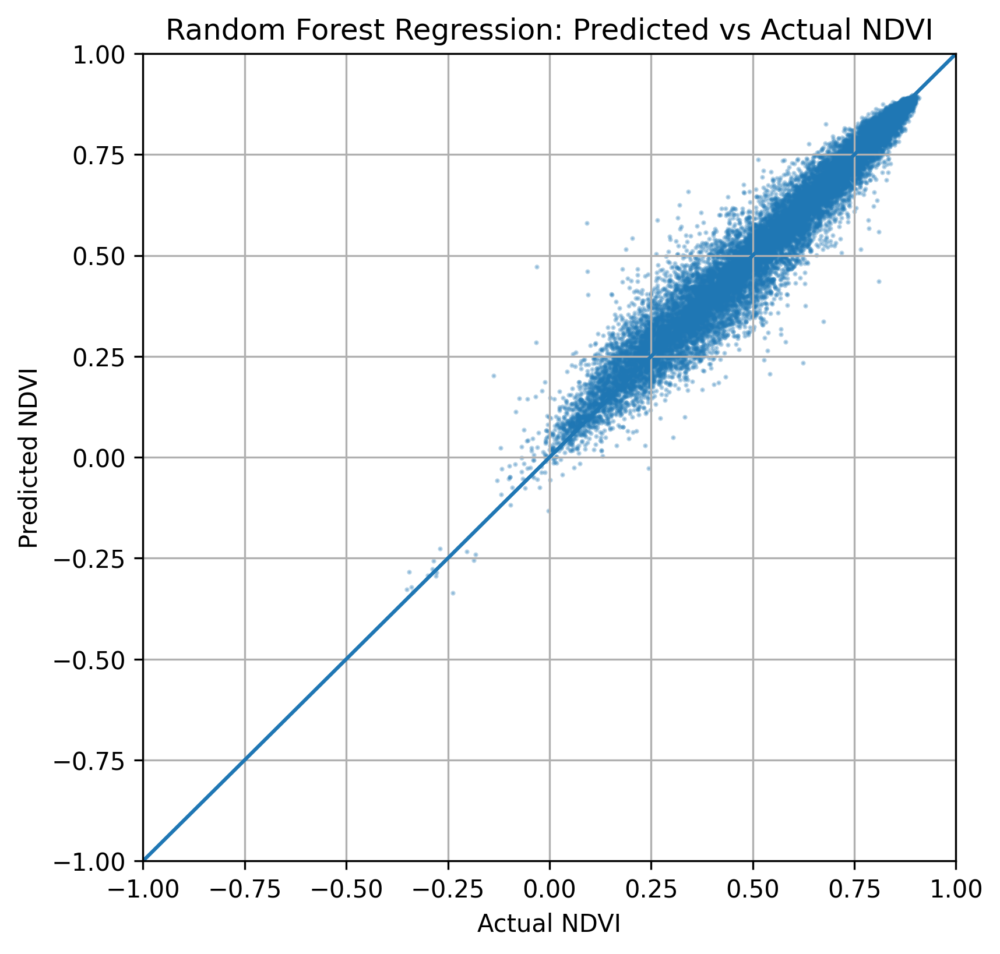

Random Forest Regression performed substantially better than Polynomial Regression, producing a lower MSE and RMSE and a higher R² value of 0.95. The predicted/actual scatter plot shows points clustered closely around the 1:1 line, this indicates that the model accurately predicted NDVI across most of the Richmond Park dataset.

This suggests the relationship between Sentinel-2 bands and NDVI is non-linear and is better captured by a flexible model. Random Forest was therefore selected as the best performing model for generating the predicted NDVI maps and testing application on Epping forest. 

### Neural Network Regression

A simple Neural Network was used as the third regression model. The model was trained using the Richmond Park training dataset. This provides a basic deep learning comparison against the Polynomial Regression and Random Forest models.

```python
nn_model = Sequential([
    Dense(64, activation='relu', input_shape=(X_train.shape[1],)),
    Dense(64, activation='relu'),
    Dense(1)
])

nn_model.compile(
    optimizer='adam',
    loss='mean_squared_error'
)

history = nn_model.fit(
    X_train,
    y_train,
    epochs=20,
    batch_size=256,
    validation_split=0.1,
    verbose=1
)

y_pred_nn = nn_model.predict(X_test).flatten()

mse_nn = mean_squared_error(y_test, y_pred_nn)
rmse_nn = np.sqrt(mse_nn)
r2_nn = r2_score(y_test, y_pred_nn)
```

Neural Network Regression results:

```text
MSE: 0.9249
RMSE: 0.9617
R²: -15.8464
```

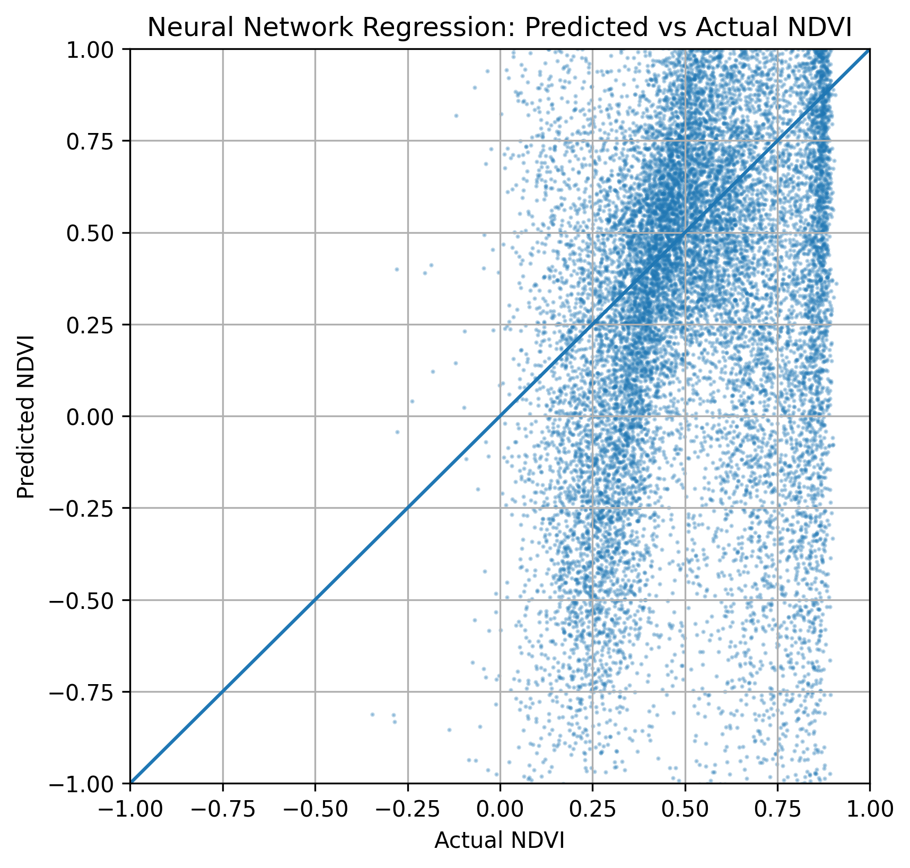

The simple Neural Network performed poorly compared with both Polynomial Regression and Random Forest Regression. The negative R² value shows that the model performed poorly compared with the other models. The predicted/actual plot also shows weak correlation between calculated NDVI and predicted NDVI. 

This result is still useful because it shows that a more complex model does not automatically perform better. For this project, Random Forest is the most accurate and reliable for predicting NDVI. 

## Comparing Model Performance

The three models showed clear differences in performance. Random Forest Regression was the strongest model, Polynomial Regression provided a reasonable baseline, and the Neural Network performed poorly in its initial form.

| Model | MSE | RMSE | R² |
|---|---:|---:|---:|
| Polynomial Regression | 0.0117 | 0.1082 | 0.7868 |
| Random Forest Regression | 0.00258 | 0.0508 | 0.9530 |
| Neural Network Regression | 0.9249 | 0.9617 | -15.8464 |

### Overall Interpretation

Random Forest Regression was selected as the final model because it produced the lowest error values and the highest R² score. This model was therefore used to generate the Richmond Park predicted NDVI map and to test whether the model could be applied to Epping Forest.

## Prediction Maps

Random Forest was selected as the best-performing model. It was applied across the full Richmond Park image to generate a spatially continuous predicted NDVI map.

```python
richmond_prediction_flat = np.full(y_richmond.shape, np.nan)

richmond_prediction_flat[valid_mask] = rf_model.predict(X_richmond_clean)

predicted_ndvi_richmond = richmond_prediction_flat.reshape(ndvi_richmond.shape)
```
### Predicted NDVI Map - Richmond Park

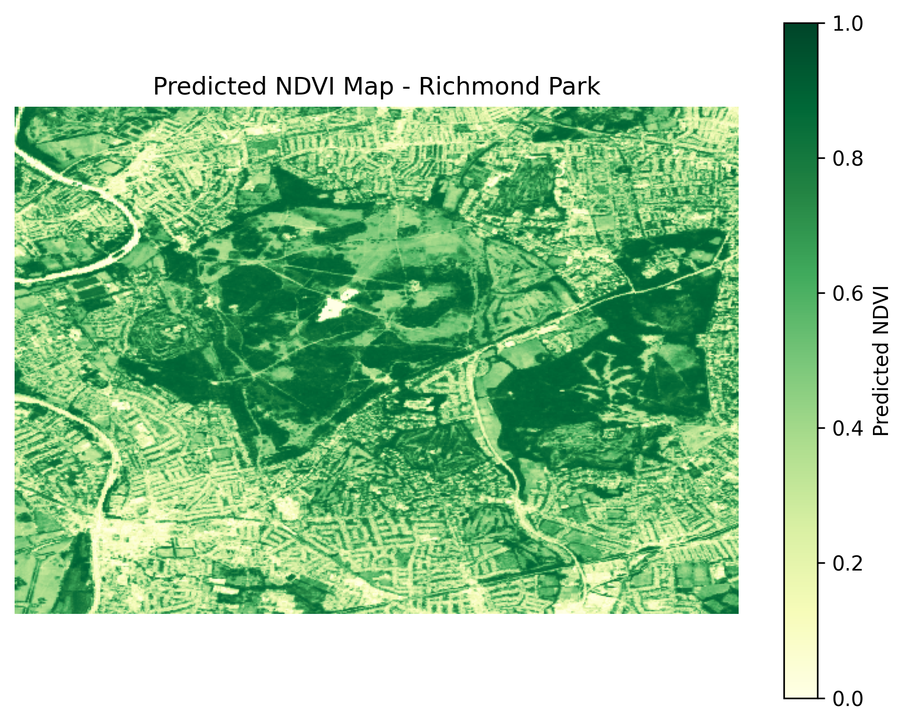

A residual map was also calculated to show the difference between the true NDVI and predicted NDVI values:

```python
residual_richmond = ndvi_richmond - predicted_ndvi_richmond
```
### Residual Map - Richmond Park

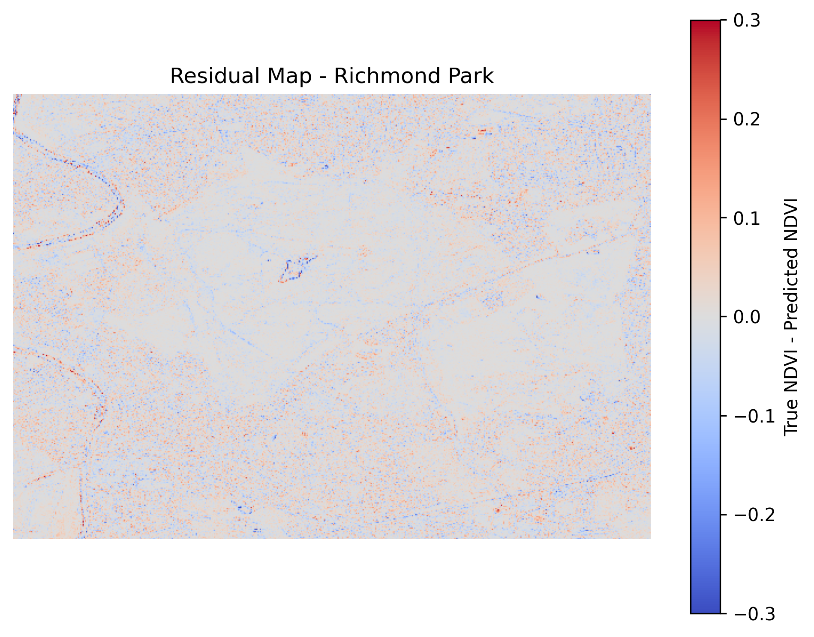

 The residual map shows that most errors are close to zero, although larger errors occur around land-cover boundaries where mixed pixels may make NDVI harder to predict.

## Independent Test on Epping Forest

To test spatial generalisation, the Random Forest model was applied to Epping Forest.

```python
epping_prediction_flat = np.full(y_epping.shape, np.nan)

epping_prediction_flat[valid_mask_epping] = rf_model.predict(X_epping_clean)

predicted_ndvi_epping = epping_prediction_flat.reshape(ndvi_epping.shape)
```
### Predicted NDVI Map - Epping Forest

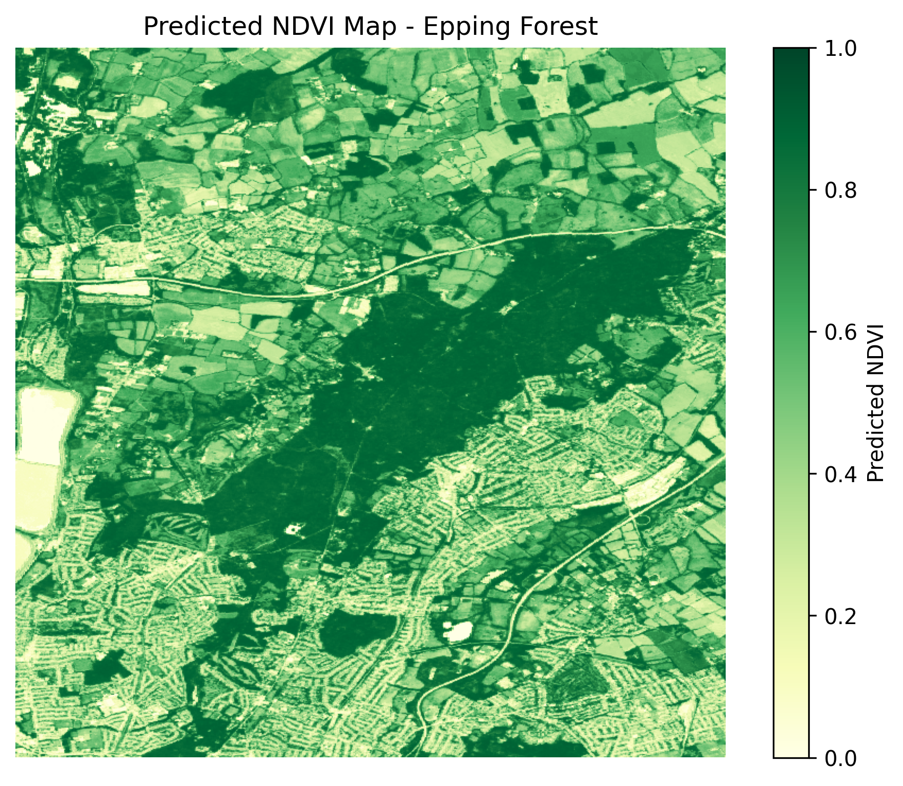

A residual map was calculated to show the difference between true NDVI and predicted NDVI:

```python
residual_epping = ndvi_epping - predicted_ndvi_epping
```
### Residual Map - Epping Forest

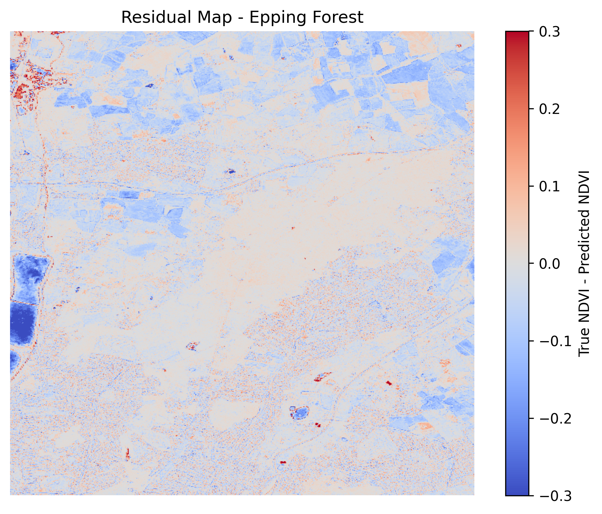

Independent Epping Forest test results:

```text
MSE: 0.00376
RMSE: 0.0613
R²: 0.9410
```

### Predicted vs Actual NDVI - Epping Forest

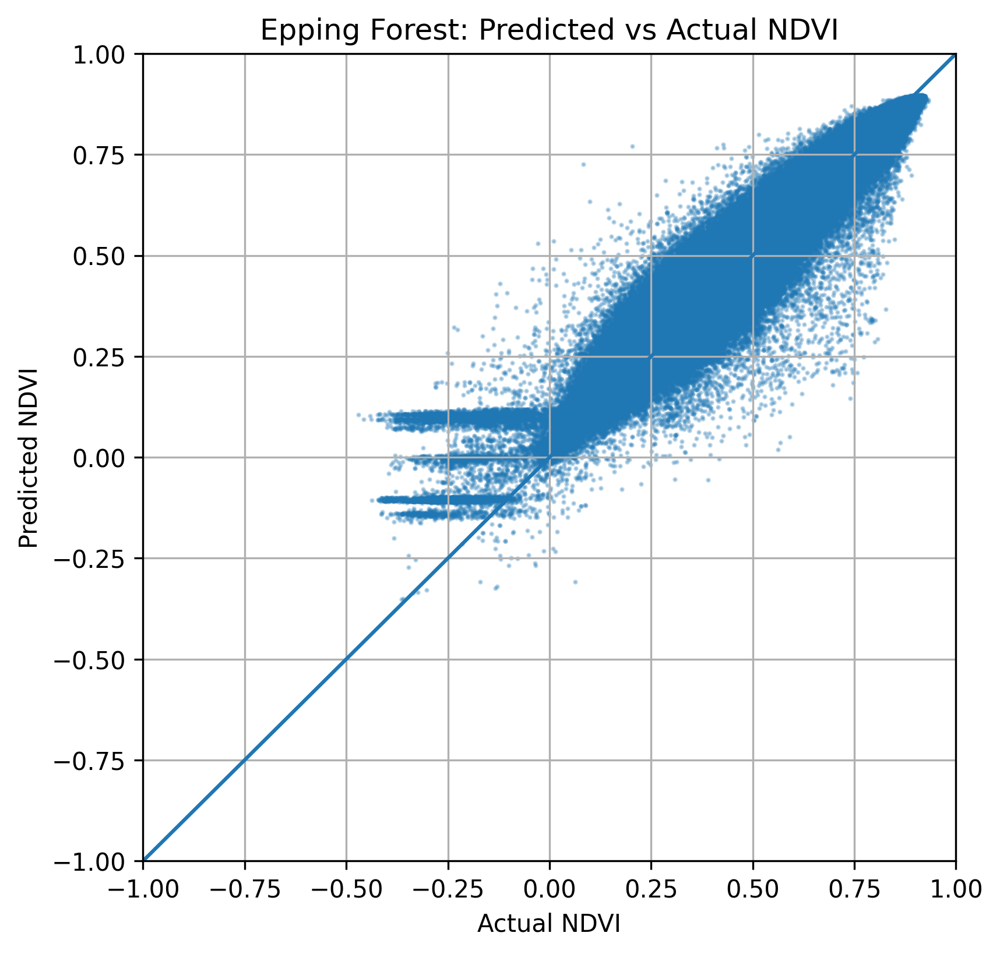

The Random Forest model trained on Richmond Park was applied to Epping Forest to test spatial generalisation. The external test results show strong performance, with an R² of approximately 0.94 and an RMSE of approximately 0.061.

The residual map shows that most errors are close to zero, although once again larger errors occur around land-cover boundaries, open fields and urban margins. This suggests that the model was able to predict NDVI accurately in a separate London vegetation landscape.

## Feature Importance

Feature importance was calculated from the best-performing Random Forest model to identify which Sentinel-2 input bands contributed most strongly to NDVI prediction.

```python
feature_names = [
    "B2 Blue", "B3 Green", "B5 Red-edge 1",
    "B6 Red-edge 2", "B7 Red-edge 3",
    "B11 SWIR 1", "B12 SWIR 2"
]

feature_importance = rf_model.feature_importances_
```

### Random Forest Feature Importance

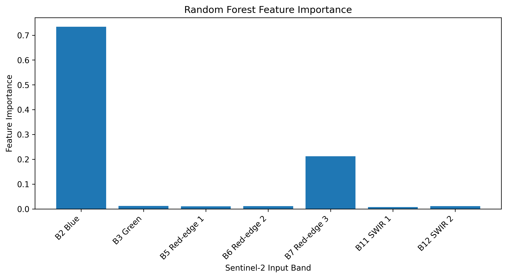


## Results and Discussion

Random Forest Regression was the best performing model, producing the lowest error and highest R² score. Polynomial regression provided a decent baseline but was less suited to the task than Random Forest. Neural Network performed badly and likely requires scaling or tuning to be able to carry out the task effectively. 

The Richmond Park predicted maps show that the Random Forest model successfully reproduced the main spatial pattern of vegetation greenness within the training area. The Epping Forest external test showed that the trained model could then be applied to an independent landscape. 

Residual maps show where prediction errors were larger, especially around land-cover boundaries due to mixed pixels. Feature importance analysis showed that B2 Blue and B7 Red-edge contributed the most strongly to the Random Forest predictions. 

Overall, the project shows that Sentinel-2 multispectral imagery can be used with AI regression models, particularly Random Forest, to predict vegetation greenness.

## Environmental Cost Discussion

This project uses existing Sentinel-2 satellite imagery, so it does not require new field data to be collected. This reduces the direct environmental cost of the research.  Although launching and operating satellites has a high environmental and financial cost, Sentinel-2 already exists and has been collecting data for many uses since June 2015. This means the use of data from Sentinel-2 in this project has a negligible effect on environmental or financial cost of running the satellite. 

This remote sensing approach is useful because it allows us to monitor vegetation greenness over larger areas without extensive site visits. It also allows the same method to be applied to different locations using consistently measured satellite data. Overall, this makes the project a relatively low-impact investigation of vegetation condition. 


## Tutorial Video

A short tutorial video explaining the project workflow, code structure, model comparison and results is provided below:

[Insert video link here]

## References

Google Earth Engine. (n.d.). Harmonized Sentinel-2 MSI: MultiSpectral Instrument, Level-2A Surface Reflectance.
https://developers.google.com/earth-engine/datasets/catalog/COPERNICUS_S2_SR_HARMONIZED

European Space Agency. (n.d.). Sentinel-2.
https://www.esa.int/Applications/Observing_the_Earth/Copernicus/Sentinel-2

U.S. Geological Survey. (n.d.). Landsat Normalized Difference Vegetation Index.
https://www.usgs.gov/landsat-missions/landsat-normalized-difference-vegetation-index

NASA Earth Observatory. (n.d.). Why is that forest red and that cloud blue? How to interpret a false-color satellite image.
https://science.nasa.gov/earth/earth-observatory/how-to-interpret-a-false-color-satellite-image/

NASA Earthdata. (n.d.). Use Remote Sensing Data to Study Vegetation Dynamics.
https://www.earthdata.nasa.gov/learn/tutorials/use-remote-sensing-data-study-vegetation-dynamics

scikit-learn. (n.d.). RandomForestRegressor.
https://scikit-learn.org/stable/modules/generated/sklearn.ensemble.RandomForestRegressor.html

scikit-learn. (n.d.). Model evaluation: regression metrics.
https://scikit-learn.org/stable/modules/model_evaluation.html

TensorFlow. (n.d.). tf.keras.Sequential.
https://www.tensorflow.org/api_docs/python/tf/keras/Sequential
